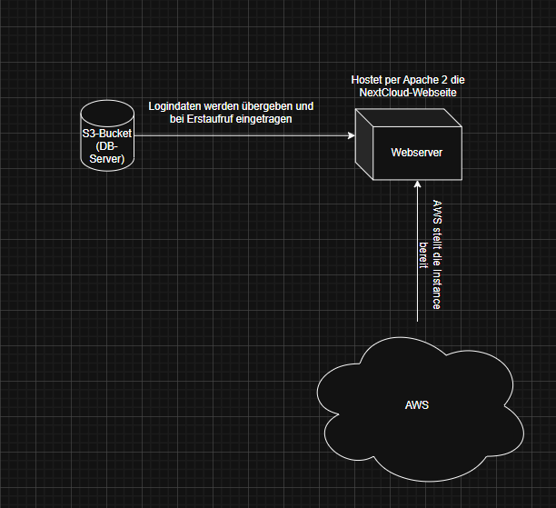

# Dokumentation Cloudprojekt Modul 346
**by Sean, Noa und Stefan**  
Klasse: INP1b

Datum: 20.11.2025 - 17.12.2025

## Kurzbeschreibung
>[!NOTE]
>
> Herr Lux hat uns die **Ausgangslage** für das Nextcloud-Projekt gegeben: automatisierte Bereitstellung auf AWS mittels Infrastructure as Code (IaC), vollständig reproduzierbar.
>Vollständige Ziele und auch wichtigee Annforderungen werden später in der Dokumentation noch aufgeziegt.

## Inhaltsverzeichnis
- [Dokumentation Cloudprojekt Modul 346](#dokumentation-cloudprojekt-modul-346)
  - [Kurzbeschreibung](#kurzbeschreibung)
  - [Inhaltsverzeichnis](#inhaltsverzeichnis)
  - [Ausgangslage](#ausgangslage)
  - [Ziele](#ziele)
    - [Lern- und Projektziele](#lern--und-projektziele)
  - [Planung und Organisation](#planung-und-organisation)
    - [Projektorganisation](#projektorganisation)
    - [Zeitplanung](#zeitplanung)
  - [Architektur](#architektur)
    - [Zielarchitektur](#zielarchitektur)
    - [Komponenten](#komponenten)
  - [Umsetzung IaC und Infrastruktur](#umsetzung-iac-und-infrastruktur)
    - [IaC-Konzept](#iac-konzept)
    - [Ordnerstruktur](#ordnerstruktur)
    - [Webserver-Setup](#webserver-setup)
    - [Datenbank-Setup](#datenbank-setup)
    - [Automatisierung / Scripts](#automatisierung--scripts)
  - [Umsetzung Nextcloud](#umsetzung-nextcloud)
    - [Installation](#installation)
    - [Erstaufruf / Installationsassistent](#erstaufruf--installationsassistent)
  - [Tests](#tests)
    - [Testkonzept](#testkonzept)
    - [Testprotokolle](#testprotokolle)
  - [Fazit \& Reflexion](#fazit--reflexion)
    - [Projektfazit (Gruppe)](#projektfazit-gruppe)
    - [Persönliche Reflexion Sean](#persönliche-reflexion-sean)
    - [Persönliche Reflexion Noa](#persönliche-reflexion-noa)
    - [Persönliche Reflexion Stefan](#persönliche-reflexion-stefan)
  - [Verzeichnisse](#verzeichnisse)
    - [Quellenverzeichnis](#quellenverzeichnis)
    - [Bildverzeichnis](#bildverzeichnis)
    - [Glossar](#glossar)

## Ausgangslage
Wir haben von unserem Lehrer, Herrn Oliver Lux, den Auftrag für ein Projekt erhalten. Dabei sollen wir einen Webserver auf AWS bereitstellen und darauf den Cloud-Dienst Nextcloud installieren und konfigurieren. Die gesamte Einrichtung wird mithilfe von Infrastructure as Code (IaC) umgesetzt und dokumentiert, sodass sie die Installation per IaC von Herrn Lux nachgestellt werden kann. Die Dokumentation erfolgt in Markdown und wird per Git bereitgestellt, sodass jedes Teammitglied unabhängig den Anderen Arbeiten kann.

## Ziele
Eines der relevantesten Ziele ist die Bereitstellung eines Cloud-basierten Services auf AWS, der funktionsfähig, erreichbar und stabil betrieben werden kann. Automatisierte Infrastrukturbereitstellung mittels Infrastructure as Code (IaC), sodass der Service jederzeit reproduzierbar in AWS erstellt werden kann. Unter anderem erstellen wir auch noch eine Versionskontrollierte Verwaltung aller Konfigurations- und Infrastrukturdateien in einem Git-Repository. Die Dokumentation des gesamten Projektes erfolgt in Markdown, inklusive Architektur, Implementierungsschritte und Konfigurationsdateien.

### Lern- und Projektziele
-	Umgang mit AWS, Linux-Servern, Webserver, DB, Nextcloud.
-	Professionelle Nutzung von Git (Commits, Branches, Zusammenarbeit).
- Erstellen einer verständlichen, prägnanten Doku mit Markdown inkl. Bildern/Diagrammen.

## Planung und Organisation
### Projektorganisation
- **Noa Imfeld** = Dokumentator
- **Stefan Kaufln** = Dokumentator
- **Sean Stäuble** = Hauptzusändiger für Skripts

> [!IMPORTANT]
> 
> Dies ist nur die Verteilung der Hauptaufgaben der Projektmitglieder. Wichtig zu wissen ist, dass Noa und Stefan auch an den Skripts gearbeitet haben. Unter anderem hat Sean auch an der Dokumentation gearbeitet.

### Zeitplanung

| Aufgabe                   | Verantwortlich | geplanter Zeitraum | gebrauchter Zeitraum |
|---------------------------|----------------|--------------------|----------------------|
| IaC Grundsetup            |      Sean      |         2h         |          3h          |
| Webserver-Konfiguration   | Sean & Stefan  |         2h         |         2.5h         |
| DB-Server & DB-Setup      |   Noa & Sean   |        1.5h        |         2.5h         |
| Nextcloud-Installation    |      Sean      |        1.5h        |          4h          |
| Tests                     |      Alle      |         1h         |          2h          |
| Dokumentation             |  Stefan & Noa  |         4h         |          8h          |
| README                    |      Sean      |         1h         |         1.5h         |

## Architektur
### Zielarchitektur
Eine Drittperson soll von ihrem Gerät aus über den Browser durchs Internet auf unsere AWS Cloud kommen. Diese ist in einem eigenen Subnetz. In diesem Subnetz sind die EC2 Instanzen also Webserver & Datenbank.
- Hinweis auf Diagramm

### Komponenten
- Webserver (Ubuntu, Nextcloud, 72.44.61.93)
- DB-Server (MySQL-DB, dynamische IP)
- Secure Group

## Umsetzung IaC und Infrastruktur
### IaC-Konzept
- Visual Studio Code, schreiben der Skripts
- PuTTY, Connection testen
 
### Webserver-Setup
Der Webserver wird per User-Data-Skript auf einer Amazon-Linux-2-Instanz eingerichtet.  
Beim ersten Start der Instanz führt das Skript folgende Schritte aus:

1. System aktualisieren: `yum update -y`.
2. PHP 8.1 aktivieren (`amazon-linux-extras enable php8.1`) und benötigte Pakete installieren:  
   `httpd`, `php`, `php-mysqlnd`, `php-gd`, `php-curl`, `php-mbstring`, `php-xml`, `php-zip`, `php-intl`, `unzip`, `wget`.
3. Apache Webserver starten und aktivieren:  
   `systemctl start httpd` und `systemctl enable httpd`.
4. Nextcloud herunterladen und entpacken (`latest.zip` von `download.nextcloud.com`),  
   nach `/var/www/html/nextcloud` verschieben und Besitzrechte auf `apache:apache` setzen.
5. Nach kurzer Wartezeit führt das Skript den Nextcloud-Installer (occ) aus und verbindet die Instanz mit der vorbereiteten RDS-MySQL-Datenbank.

Der Webserver stellt Nextcloud anschließend unter `http://<EC2-PUBLIC-IP>/nextcloud` bereit [web:99][web:104]. 

### Datenbank-Setup
Die Datenbank wird als Amazon RDS MySQL Instanz in der Region `us-east-1` bereitgestellt.  
Dabei verwendet das Skript folgende Parameter:

- Instanzname: `nextcloud-db`
- Engine: `mysql`
- Instanzklasse: `db.t3.micro`
- Speicher: 20 GB
- DB-Name: `nextcloud`
- Benutzer: `ncuser`
- Passwort: `Nextcloud123!`
- Öffentlich erreichbar: `true`
- Security Group: `SG_Nextcloud_RDS` (erlaubt Port 3306 von der EC2-SG)

Zuerst erstellt das Skript die Security Group `SG_Nextcloud_RDS` und erlaubt eingehenden Traffic auf Port 3306 ausschließlich von der EC2‑Security‑Group `SG_Nextcloud_EC2`.  
Anschließend wird mit `aws rds create-db-instance` die MySQL‑Instanz erzeugt und mit `aws rds wait db-instance-available` gewartet, bis sie verfügbar ist.

Der Datenbank-Endpunkt wird danach über `aws rds describe-db-instances` ermittelt und in der Variable `DB_ENDPOINT` gespeichert.  
Dieser Endpunkt wird später im `occ maintenance:install`‑Befehl genutzt, damit Nextcloud sich direkt mit der RDS‑Datenbank verbinden kann.

## Nextcloud
Die Nextcloud-Installation erfolgt vollständig automatisiert im User-Data-Skript der EC2-Instanz:

1. Nextcloud wird im Verzeichnis `/tmp` als `latest.zip` von `https://download.nextcloud.com/server/releases/latest.zip` heruntergeladen und entpackt.  
2. Der entpackte Ordner `nextcloud` wird nach `/var/www/html/` verschoben, sodass die Anwendung unter `/var/www/html/nextcloud` liegt.  
3. Die Besitzrechte werden auf `apache:apache` gesetzt, damit der Webserver alle Dateien lesen und schreiben kann.  
4. Nach einer kurzen Wartezeit (`sleep 30`) wird der Nextcloud-Installer per CLI ausgeführt

### Erstaufruf / Installationsassistent
Wie bereits erwähnt im Bash-Skript in welchem Apache2 und php installiert wird, wird der Webroot entleert und das Archiv gelöst.
Der DB-User wird am Ende des Skripts ausgegeben. Das PW des DB Benutzers (wird ebenfalls am Ende des Skripts ausgegeben)
Beim Erstaufruf, werden folgende DB-Daten angegeben:

- Name des Adminkontos: administrator
- Passwort des Adminkontos: nextcloud2!
- Datenortner: /var/www/html/nextcloud/data
- DB-Benutzer: (Am Ende des Skripts Ausgegeben)
- DB-Passwort: (Am Ende des Skripts Ausgegeben)
- DB-Name: (Am Ende des Skripts Ausgegeben)
- DB-Host: ("IP des Datenbankservers:Port" / Am Ende des Skripts Ausgegeben)

## Tests
### Testkonzept
Das Ziel der Tests ist verschiedene Szenarien zu testen, und zu schauen ob die Website sicher ist, und das gefragte jeweils ausgibt und im allg. das macht was man will. Wir haben verschiedene Tests, zum einen der Abruf der IP in der Suchmaschine, dann noch die Verbindung von Nextcloud und der DB und zu guter letzt die Ausführung der IaC Skripts.

### Testprotokolle

| Test-ID | Datum      | Testperson | Beschreibung                      | Erwartetes Ergebnis                         | Tatsächliches Ergebnis |
|--------:|------------|-----------|------------------------------------|---------------------------------------------|------------------------|
| T1      |  13.12.25  |    SS     | Aufruf IP                          | Man kommt von Drittgerät auf Webserver      |     funktionierte      |
| T2      |  14.12.25  |    SS     | Verbindung Nextcloud ↔ DB          | Verbindung erfolgreich                      |     funktionierte      |
| T3      |  16.12.25  |    SS     | Ausführung IaC-Script              | Infrastruktur wird ohne Fehler erstellt     |     funktionierte      |

## Fazit & Reflexion
### Projektfazit (Gruppe)
- Wurden alle Anforderungen erfüllt?
  - Wir haben Wert darauf gelegt möglichst alle Anforderungen zu erfüllen, und haben die meisten auch erfüllen können.
- Was hat gut funktioniert?
  - Die Arbeit zusammen in der Guppe hat äusserst gut funktioniert, auch wenn wir mal nicht alle zur gleichen Zeit Zeit hatten, haben wir gut zusammengearbeitet.
- Was könnte verbessert werden?
  - Wir haben beim Testen oft kleine Flüchtigkeitsfehler gemacht was das ganze Ergebnis verhauen hat.

### Persönliche Reflexion Sean
**Learnings**
Ich habe viel über PowerShell- und IAC-Skripte gelernt. Was ich so besonderes gelernt habe, ist, dass man eigentlich alles, was man in AWS machen kann, auch per IAC ablaufen kann, was meiner Meinung nach, für das Erstellen komplizierter ist, aber im nachhinein das Einrichten und Wiederholen um vieles vereinfacht.
 
**Schwierigkeiten**
Eine meiner grössten Schwierigkeiten für mich, war es, dass ich am Anfang dachte, dass mein Skript überhaupt nicht funktionierte. Diese Vermutung hatte sich in meinem Kopf gebildet, da ich, sobald ich per IP mich auf die Webseite verbinden wollte, die Apache 2 Default-Page zu Augen bekam. Ich habe dann lange nach diesem Fehler recherchiert, bis mir der Gedanke kam, der Initialisierung eine längere Wartezeit zu genehmigen. 
Ein anderes Problem war, dass ich lange den 3306 Port für MariaDB nicht freigegeben habe und bei dem Host auf der NextCloud-Webseite nicht die IP des DB-Servers angegeben habe.
Es gab noch eine Schwierigkeit, für welche ich indirekt nichts kann, nämlich war das die grosse Anzahl an Projekten, die wir gleichzeitig bearbeiten mussten, was es einem schwierig machte, sich auf ein Projekt voll zu fokusieren.
 
**Verbesserungsansätze**
In Zukunft möchte ich mich besser zu den Fehlern informieren, indem ich auch bei meiner Lehrperson frühzeitig Fragen zu ihnen stelle.
Ebenfalls möchte ich in Zukunft von Anfang an mir mehr Mühe und mehr Elan für die Projekte geben.
 

### Persönliche Reflexion Noa
**Learnings**  
- Ich habe gelernt, wie man mit einfachen Skripts einen Webserver und eine Datenbank in AWS startet und Nextcloud darauf vorbereitet.  
- Jetzt verstehe ich besser, wie Webserver und Datenbank zusammenarbeiten und wozu Security Groups und interne IPs da sind.
 
**Schwierigkeiten**  
- Am schwierigsten war es, die User‑Data‑Skripte so hinzubekommen, dass der Nextcloud‑Installer wirklich über die öffentliche IP erscheint.  
 
**Verbesserungsansätze**  
- Beim nächsten Projekt möchte ich früher testen und mir Fehler mit mehr Ausgaben im Skript besser sichtbar machen.

### Persönliche Reflexion Stefan
**Learnings**
- Ich habe durch dieses Projekt viel über PS gelernt sowie auch wie man Github in Verknüpfung mit VSC benutzt. Ausserdem habe ich die Grundlage für IaC auch sehr gut und viel gelernt durch dieses Projekt.

**Schwierigkeiten**
- Ich hatte zwar trotz guter Kommunikation noch oft Probleme mich zurecht zu finden, wenn die anderen gearbeitet haben und ich später alles aufgemacht habe. Ausserdem hatte ich allg. recht viele Probleme mit dem syncen.

**Verbesserungsansätze**
- Ich möchte von Anfang an schon meine Private Zeit aufgeben, und nicht erst am Wochenende zuvor.

## Quellenverzeichnis
- [1] Perplexity AI - https://www.perplexity.ai - zuletzt besucht am 17.12.2025
- [2] ChatGPT - (App Version) - zuletzt besucht am 15.12.2025

### Glossar
- IaC: IT-Systeme werden nicht von Hand eingerichtet, sondern automatisch mit Code erstellt und verwaltet.
- VM: Ein „virtueller Computer“, der auf einem echten Computer läuft und sich wie ein eigener PC verhält.
- Nextcloud: Eine private Cloud, in der man Dateien, Fotos und Kalender selbst speichern und teilen kann.
- Repository: Ein Online-Ablageort für Code, in dem Dateien gespeichert, geändert und gemeinsam genutzt werden.
